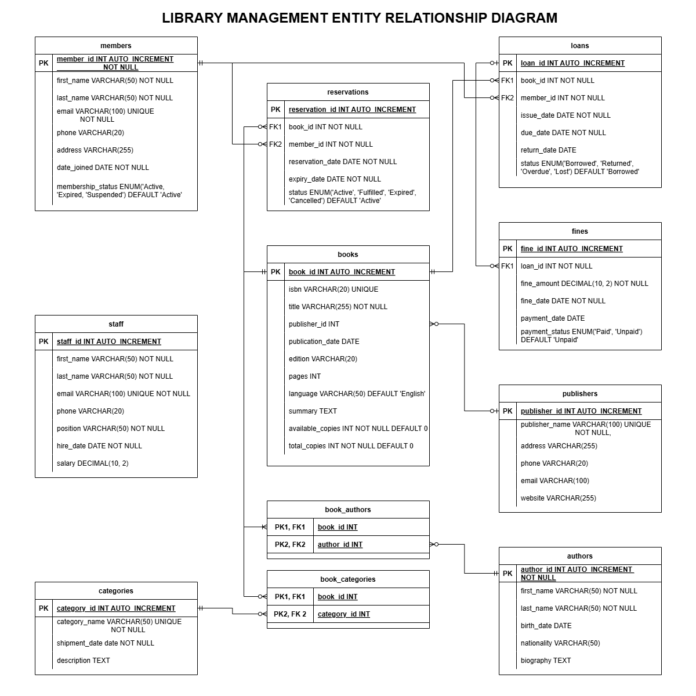
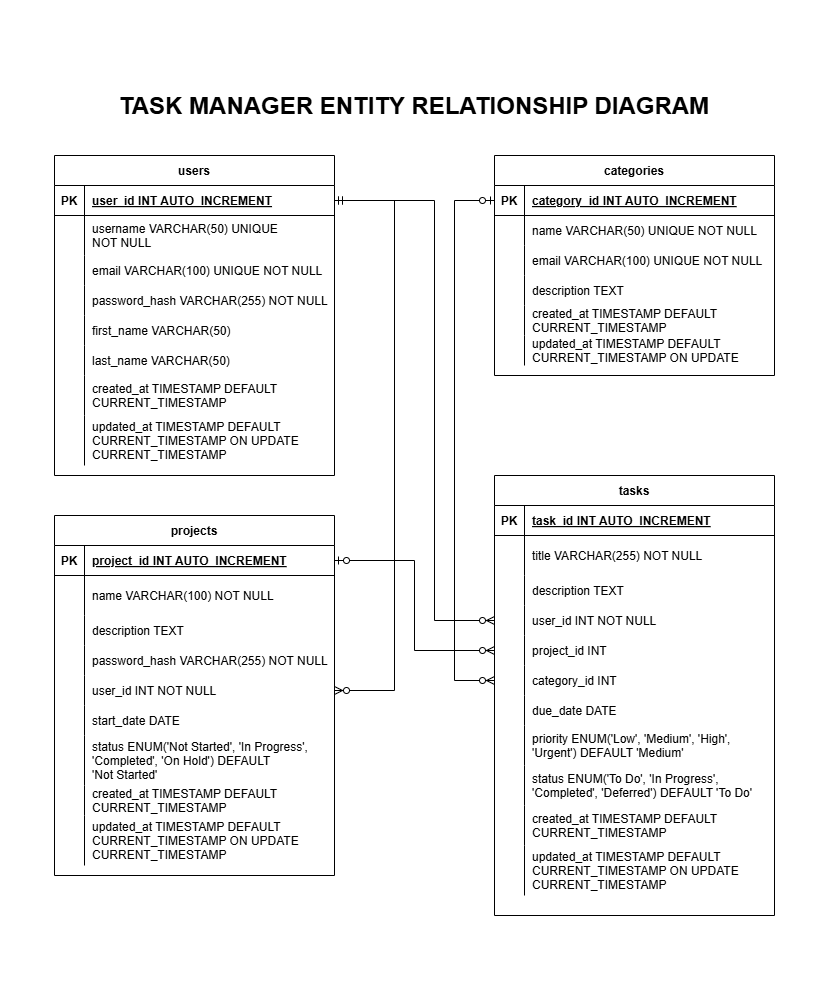

# Database Design & Programming with SQL - Week 8 Assignment

This repository contains solutions for the Week 8 Assignment of the Database Design & Programming with SQL module.

## Project Overview

This project consists of two main components:

### 1. Library Management System (MySQL)

A comprehensive relational database for library management, featuring:
- Multiple interconnected tables with proper constraints
- Various relationship types (one-to-one, one-to-many, many-to-many)
- Sample data for testing
- Stored procedures and triggers

### 2. Task Manager API (MySQL + FastAPI)

A CRUD API built with FastAPI and MySQL that allows users to:
- Manage users, projects, tasks, and categories
- Create, read, update, and delete operations for all entities
- Relationships between different entities

## Repository Structure

```
├── README.md
├── library-management/
│   └── library_management.sql
├── task-manager/
│   ├── database/
│   │   └── task_manager.sql
│   ├── app/
│   │   ├── main.py
│   │   ├── models.py
│   │   ├── schemas.py
│   │   ├── database.py
│   │   ├── crud.py
│   │   └── __init__.py
│   ├── requirements.txt
│   └── .env.example
└── docs/
    ├── library_erd.png
    └── task_manager_erd.png
```

## Setup Instructions

### Library Management System

1. Create a MySQL database
2. Import the SQL script:
   ```bash
   mysql -u yourusername -p yourdatabase < library-management/library_management.sql
   ```
3. The database will be created with all tables, relationships, sample data, stored procedures, and triggers.

### Task Manager API

1. Create a MySQL database for the Task Manager
2. Import the SQL script:
   ```bash
   mysql -u yourusername -p yourdatabase < task-manager/database/task_manager.sql
   ```
3. Install the required dependencies:
   ```bash
   cd task-manager
   pip install -r requirements.txt
   ```
4. Create a `.env` file based on the `.env.example` template
5. Run the FastAPI application:
   ```bash
   cd task-manager
   uvicorn app.main:app --reload
   ```
6. Access the API documentation at http://localhost:8000/docs

## Entity Relationship Diagrams

### Library Management System


### Task Manager


## API Endpoints

The Task Manager API provides the following endpoints:

- `/users/` - Manage users
- `/categories/` - Manage task categories
- `/projects/` - Manage projects
- `/tasks/` - Manage tasks
- Additional routes for filtering tasks by user, project, or category

For detailed documentation, please visit the Swagger UI at http://localhost:8000/docs when the application is running.